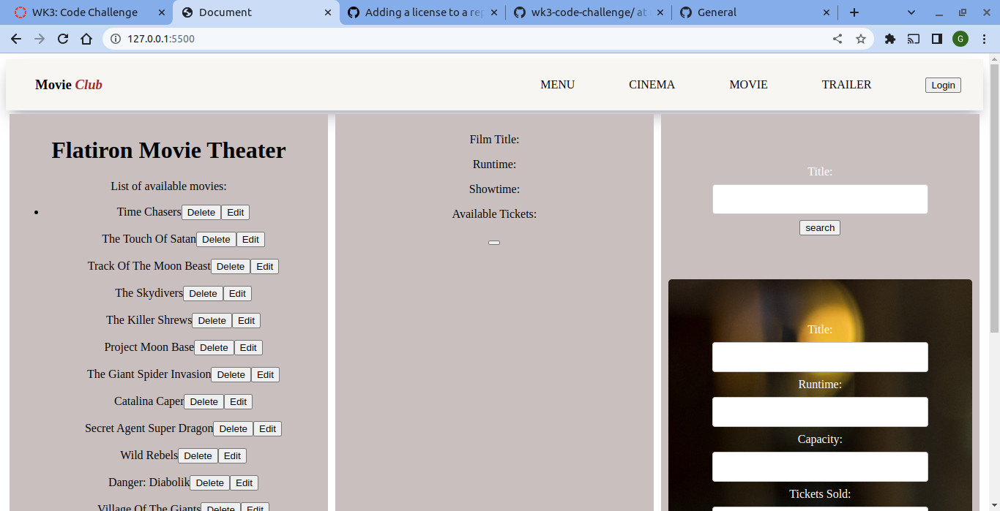
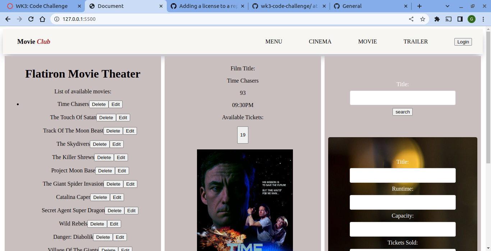
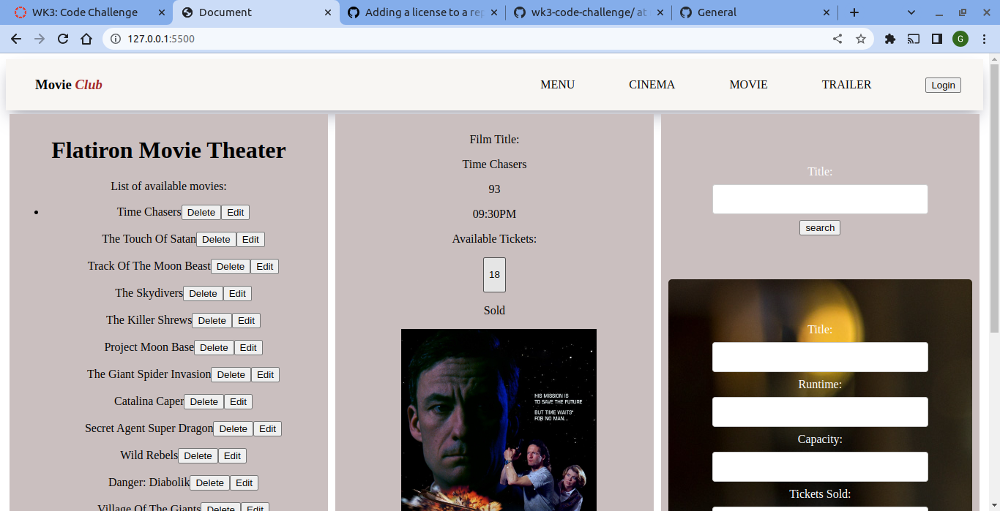

# Movie Club

#### Created By Geoffrey Bii on 01-07-2023

## Design Link

[github](https://github.com/Bii-teki/phase-1-wk2-code-challenge)

## Description

It is a mini web application which which is created using javascript

Movie Club allows a user to purchase movie tickets from the
theater.

## Setup Requirements

- Git
- Web browser or your choice
- Github
- NPM (https://www.npmjs.com/)
- 

## Technologies Used

The following have been used on this project:

- HTML
- CSS
- Javascript

#### Live link to view the project <a href="https://github.com/Bii-teki/wk3-code-challenge/">View Movie Club</a>

## Screenshots Of the Website

- Homepage

  

- view

   

  - After you have bought ticket

   

## Support and contact details 🙂

To make a contribution to the code used or any suggestions you can click on the contact link and email me your suggestions.

- Email: gefbii@gmail.com

## License

Copyright (c) 2023 Geoffrey Bii

Permission is hereby granted, free of charge, to any person obtaining a copy
of this software and associated documentation files (the "Software"), to deal
in the Software without restriction, including without limitation the rights
to use, copy, modify, merge, publish, distribute, sublicense, and/or sell
copies of the Software, and to permit persons to whom the Software is
furnished to do so, subject to the following conditions:

The above copyright notice and this permission notice shall be included in all
copies or substantial portions of the Software.

THE SOFTWARE IS PROVIDED "AS IS", WITHOUT WARRANTY OF ANY KIND, EXPRESS OR
IMPLIED, INCLUDING BUT NOT LIMITED TO THE WARRANTIES OF MERCHANTABILITY,
FITNESS FOR A PARTICULAR PURPOSE AND NONINFRINGEMENT. IN NO EVENT SHALL THE
AUTHORS OR COPYRIGHT HOLDERS BE LIABLE FOR ANY CLAIM, DAMAGES OR OTHER
LIABILITY, WHETHER IN AN ACTION OF CONTRACT, TORT OR OTHERWISE, ARISING FROM,
OUT OF OR IN CONNECTION WITH THE SOFTWARE OR THE USE OR OTHER DEALINGS IN THE
SOFTWARE.
